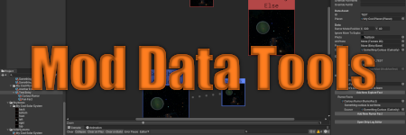

# Mod Data Tools for Outer Wilds

This project aims to create an opinionated Unity-centric framework for defining and editing the various aspects of a large-scale Outer Wilds mod that uses [New Horizons](https://github.com/Outer-Wilds-New-Horizons/new-horizons): solar systems, planets, ship logs, dialogue trees, etc.

It is not without its drawbacks, as it currently follows an all-or-nothing approach to mod structure, where you primarily work in a Unity project and export/generate your mod from there, instead of working directly with New Horizons' mod structure and config files. However, there are some significant benefits, such as a visual editing experience, edit-time validation of data, and the ability to reference data at runtime without relying on brittle transform paths or hard-coded IDs.

## Features
- Create Unity data assets representing Solar Systems, Planets, Ship Log Entries, Ship Log Facts, Dialogues, Dialogue Conditions, and Translator Texts.
- Generate New Horizons .json and .xml files automatically from the data assets.
- Automatically export other assets referenced in the data assets, such as ship log entry photos, solar system skybox images, and more.
- Override generated files with statically defined .json or .xml files, as needed.
- Visual ship log editor to arrange and edit ship log entries, with click-and-drag support.
- Tooltips explaining each field are available by mousing over the field names in the Unity inspector.
- Preliminary (non-visual) dialogue tree and translator text editors.

## Planned Features
- Visual dialogue tree editor
- Visual translator text editor
- Localization support
- New Horizons planet Props editing

## Limitations
- Most planet config settings are not implemented yet, so you will need to override the generated .json files with your own planet config .json files by setting the `OverrideConfigFile` field.

## Usage

This project is comprised of two components, developed in tandem:
- A utility mod, available on the Outer Wilds Mod Manager, that provides various Unity asset classes representing common mod data.
- A set of Unity editor scripts that can be imported into a mod's Unity project to allow for easy editing of the assets provided by the utility mod.

To use these in your mod, import the latest .unitypackage file from this repository's releases into your mod's Unity project. If you haven't already set up a Unity project for your mod, you can clone the [outer-wilds-unity-template repo](https://github.com/ow-mods/outer-wilds-unity-template).

Once you have imported the editor scripts into your Unity project, you can create the various data assets from the Assets -> Create... menu. They can then be edited from the Inspector. If a custom visual editor window is available for a data asset, there will be a button in the Inspector to open it.

You must have a Mod Manifest asset created in your project and configured to represent your mod. This asset represents the `manifest.json` file for your mod, and determines the export path for your mod data. The full calculated ID of this asset will become the `UniqueName` of your mod.

When you're ready to package your data into a mod, you can export your data from the top menu under Export -> Mod Data. By default, the project will be exported to `%APPDATA%\OuterWildsModManager\OWML\Mods\{UniqueName}`. This can be changed in the settings as needed. The Export step will build all asset bundles, generate any New Horizons .json or .xml files, and copy any other static assets to the mod folder.

If you use a separate project for mod code, you can set your Mod Manifest's Filename property to the name of your mod's DLL, and use the standard `ModName.csproj.user` approach to export your mod code DLL to the mod folder.